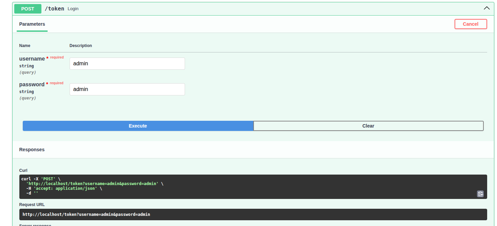

# Crear entorno
```sh
python3 -m venv venv
```


# Activar en Ubuntu
```sh
source venv/bin/activate
```

# Instalar dependencia 
```sh
pip install -r requirements.txt
```

# Generar archivo requeriment 

```sh

pip freeze > requirements.txt
```


# Ejecutar proyecto
```sh
export FLASK_APP=run.py
flask run
```

# Ingressar a la base de datos posgrest

```sh
 docker compose exec db psql -U main -d main
```

# Generar token

